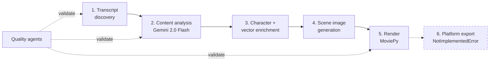

# Anime Video Generator

[](https://github.com/kalebkougl/anime-video-generator/actions/workflows/ci.yml)

Turns a TV episode transcript into a narrated summary video. A multi-stage
pipeline finds the transcript, summarizes it with Gemini into a typed schema,
enriches scenes with character data from ChromaDB, generates a frame per scene,
and renders the whole thing to MP4 with MoviePy.

## Output

<!-- DEMO GIF: record a few seconds of a rendered MP4 (e.g. `My Hero Academia/Season1/Episode1/My Hero Academia_1_1.mp4`), save it as docs/assets/demo.gif, and replace this block with  — generated output directories are gitignored, so any asset must be copied into docs/assets/ to render on GitHub. -->

> **Demo GIF placeholder.** Not yet committed — see the HTML comment above.

A run over *My Hero Academia* S1E1 produces four 1024x574 scene frames, a
narration WAV and a compiled MP4 in `My Hero Academia/Season1/Episode1/`
(gitignored, so nothing generated is checked in). When image generation is
unavailable, `create_placeholder_image()` writes a captioned title card
carrying the scene prompt instead of failing the render — the pipeline degrades
to something watchable rather than crashing.

## Quickstart

Python **3.11 or 3.12**. 3.9/3.10 fail on the pinned numpy; 3.14 has no torch
wheels yet.

```bash
git clone https://github.com/kalebkougl/anime-video-generator.git
cd anime-video-generator

uv venv --python 3.12 && source .venv/bin/activate
uv pip install -r requirements.txt          # ~26s

cp .env.example .env                        # then set GOOGLE_API_KEY

# Is this show reachable? Discovery only, no LLM calls, no cost.
python main.py test-transcript "My Hero Academia" 1 4

# Full pipeline: transcript -> summary -> scenes -> frames -> MP4
python main.py process-episode "My Hero Academia" 1 4 --full
```

`GOOGLE_API_KEY` is a Google AI Studio key ([get one](https://aistudio.google.com/apikey))
and is required; content generation is stage 2 and has no offline substitute.
Output lands in `<Show>/Season<N>/Episode<M>/`. `pip install -e .` registers an
`anime-generator` console script equivalent to `python main.py`. Character and
vector features need `uv pip install -r requirements-vector.txt` (ChromaDB,
sentence-transformers). All 27 subcommands: **[docs/cli.md](docs/cli.md)**.

## Architecture



`WorkflowOrchestrator` (`agents/workflow_orchestrator.py`) drives all six
stages. Each agent is constructed behind a try/except that sets the attribute to
`None` on failure, so a missing optional dependency degrades the run instead of
ending it.

Full write-up, including a per-stage status table:
**[docs/architecture.md](docs/architecture.md)**.

## Engineering notes

### Constraining a nondeterministic model

Everything downstream of stage 2 assumes a fixed shape: a list of plot points
and a narration script. Free-form LLM text would mean parsing prose on every
run and failing differently each time. Instead the model is bound to a Pydantic
schema at construction:

```python
self.model_with_structure = self.model.with_structured_output(Episode_Summary_Schema)
```

`Episode_Summary_Schema` (`core/schemas.py`) declares `plot_points: List[str]`
and `youtube_transcript: str` with per-field descriptions that double as prompt
instructions. Stage 4 iterates `plot_points` directly: one plot point, one scene
prompt, one frame. The schema is the contract between a probabilistic stage and
deterministic ones.

### Quality gates with explicit criticality

`agents/quality_agents/` holds six stage-specific validators that each score
their stage 0.0-1.0. What makes them useful is the gate table in
`quality_coordinator.py`:

```python
'transcript_discovery': {'min_score': 0.6, 'critical': True},
'content_generation':   {'min_score': 0.7, 'critical': True},
'episode_discovery':    {'min_score': 0.6, 'critical': False},
```

Thresholds differ by stage — a scraped transcript is allowed to be scrappier
than a generated summary — and criticality is separate from score, so a weak
episode-discovery result degrades the run while a weak transcript stops it.
Without the `critical` flag every validator ends up either advisory (and
ignored) or fatal (and disabled in practice).

### Content caching to avoid re-spending on generation

Regenerating a scene costs an API call and wall-clock time, and adjacent
episodes of the same show ask for visually near-identical scenes. `ContentCache`
(`core/content_cache.py`) does an O(1) hash lookup first, then falls back to
`SimilarityCalculator`, which scores prompts by weighted overlap of extracted
visual keywords (0.7) against raw text similarity (0.3) and reuses a hit above
the configured threshold (default 0.85). Entries carry a TTL and are evicted
LRU, so the cache cannot grow unbounded across a season batch. It tracks
`CacheStats.hit_rate` at runtime, but no benchmark has been run against it, so
no savings figure is claimed here.

### Visual coherence across scenes

Frames generated independently drift: the same character returns with a
different palette, line weight and face. `VisualCoherenceManager`
(`core/visual_coherence_manager.py`) attacks this from two sides.
`build_coherent_prompt()` — the half wired into the pipeline — folds
episode-level style and per-character appearance references into every scene
prompt before generation, pushing coherence into the input rather than
repairing it afterwards.

`generate_consistent_image()` is the measured half: a generate → score → retry
loop where OpenCV scores color coherence (k-means over dominant colors), style
consistency (Canny edge-density comparison) and character similarity (grayscale
histogram correlation) against stored references, retrying until the combined
score clears `consistency_threshold`. It requires an image generator injected at
construction and raises `NotImplementedError` without one rather than inventing
a path. Nothing in the repo injects one today, so the scoring loop is
exercisable but unused.

### What I would do differently

The degrade-to-`None` convention keeps runs alive but pushes `if self.x is not
None` into every call site, and a run that silently skipped enrichment looks
like one that did it. A capability object recording which stages actually
executed, surfaced in the output, would remove that ambiguity cheaply. The
show/season/episode triple is also threaded through as three arguments rather
than one value object — which is exactly why the ChromaDB metadata rules in
`core/metadata_schemas.py` have to exist as a guard rail.

## Status and limitations

- **Platform export is scaffolded, not implemented.** `media/format_exporters/`
  declares real constraints for YouTube Shorts, TikTok, Instagram Reels and
  Twitter, but `export_video()` raises `NotImplementedError`. Callers catch it
  and return `{'success': False, 'status': 'skipped_not_implemented'}`.
  `--format standard` is the only path that writes a file.
- **Character and vector features need optional extras** from
  `requirements-vector.txt`. Without them the agents are `None` and scenes fall
  back to uniform 3.0-second durations.
- **Visual coherence scoring has no caller.** Prompt construction is wired in;
  `generate_consistent_image()` is not.
- **Tests:** 149 passed, 2 skipped. Seven test files perform live network I/O
  and sit behind a `network` marker that `pytest` deselects by default
  (`addopts = "-m 'not network'"`); run them with `pytest -m network`.

Per-stage status table:
[docs/architecture.md](docs/architecture.md#status-of-each-stage).

## Documentation

- [docs/architecture.md](docs/architecture.md) — how the system is put together, stage by stage
- [docs/cli.md](docs/cli.md) — all 27 commands, arguments and flags
- [docs/CHARACTER_ANALYSIS_GUIDE.md](docs/CHARACTER_ANALYSIS_GUIDE.md) — ChromaDB character analysis
- [docs/CONTENT_CACHING_GUIDE.md](docs/CONTENT_CACHING_GUIDE.md) — cache configuration and tuning
- [docs/TRANSCRIPT_AGENT_GUIDE.md](docs/TRANSCRIPT_AGENT_GUIDE.md) — transcript discovery and scoring

## License

MIT — see [LICENSE](LICENSE).
