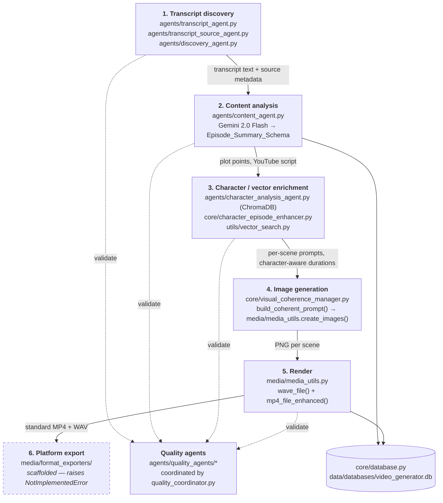

# Architecture

How the anime video generator is put together, and what each part actually does
today. Where a subsystem is scaffolded rather than working, this document says
so — see [Status of each stage](#status-of-each-stage).

## The pipeline

The system turns an episode of a TV show into a short summary video. One episode
flows through six stages:



`agents/workflow_orchestrator.py` (`WorkflowOrchestrator`) is the class that
drives stages 1-6. `WorkflowOrchestrator.generate_all_media()` is the single
method containing stages 3 through 6.

### Stage 1 — Transcript discovery

`TranscriptDiscoveryAgent` (`agents/transcript_agent.py`) searches public
transcript sites for a given show/season/episode. It generates many candidate
URL slugs per show name (dashes, underscores, acronyms, subtitle splits,
number-word conversion), fetches candidates, parses them with BeautifulSoup and
scores the extracted text for transcript-likeness.

Supporting agents:

- `TranscriptSourceDiscoveryAgent` (`agents/transcript_source_agent.py`) —
  finds and rates *sources* rather than individual episodes.
- `EpisodeDiscoveryAgent` (`agents/discovery_agent.py`) — enumerates episodes
  and their metadata for a show.
- `EpisodeConfigManager` (`agents/config_manager.py`) — per-show episode counts
  and known episode titles, which sharpen URL matching.

Key entry point:

```python
from agents.transcript_agent import TranscriptDiscoveryAgent

agent = TranscriptDiscoveryAgent()
result = agent.find_episode_transcript("My Hero Academia", 1, 4, "Start Line")
# result: {'transcript', 'title', 'source', 'url', 'quality_score', 'content_length'}
# or None if nothing usable was found
```

Quality scoring (0.0-1.0) weighs transcript length, dialogue markers (colons,
quotes), narrative/scene-direction cues, and capitalized-token density as a
proxy for character names.

### Stage 2 — Content analysis

`ContentAgent` (`agents/content_agent.py`) sends the transcript to Gemini
2.0 Flash, reached through LangChain's `init_chat_model("gemini-2.0-flash",
model_provider="google_genai")`. The orchestrator constructs the model once and
passes it in; if the model cannot be initialized the orchestrator sets
`self.content_agent = None` and degrades rather than crashing.

Output is coerced into `Episode_Summary_Schema` (`core/schemas.py`): a set of
plot points plus a narration script ("YouTube transcript"). Those plot points
become the per-scene image prompts downstream.

### Stage 3 — Character and vector enrichment

Two independent enrichment paths:

**Character analysis** — `CharacterAnalysisAgent`
(`agents/character_analysis_agent.py`) embeds character dialogue and behaviour
into ChromaDB, producing per-character profiles, relationship maps, development
arcs across episodes, and semantic search over character moments.
`EpisodeCharacterEnhancer` (`core/character_episode_enhancer.py`) consumes those
profiles to weight scenes — characters with more narrative importance get longer
on-screen durations, which is where the per-scene `duration` values come from.

**Episode vector search** — `VectorSearchManager` (`utils/vector_search.py`)
indexes whole episodes for semantic "find similar episodes" queries.

Both depend on the optional extras in `requirements-vector.txt` (`chromadb`,
`sentence-transformers`). When those are absent the agents are set to `None` and
the pipeline falls back to uniform 3.0-second scene durations.

### Stage 4 — Image generation

`VisualCoherenceManager` (`core/visual_coherence_manager.py`) does **not**
generate images. Its role in the pipeline is `build_coherent_prompt()`, which
folds episode-level style and per-character appearance consistency instructions
into each scene prompt:

```python
coherent_prompt = await self.visual_coherence.build_coherent_prompt(
    scene["enhanced_prompt"], scene["characters"], episode_context
)
```

The manager also offers `generate_consistent_image()`, a
generate → score → retry loop that measures colour coherence, style consistency
and character similarity with OpenCV. That loop needs an image generator
*injected* at construction time:

```python
VisualCoherenceManager(consistency_threshold=0.8, image_generator=my_generator)
```

`image_generator` is `Callable[[str], Union[str, Awaitable[str]]]` — it takes an
enhanced prompt, writes an image to disk, and returns the path. Without one,
`generate_consistent_image()` raises `NotImplementedError` rather than inventing
a path. The orchestrator does not inject one *here*, so only the prompt half of
this manager is wired into the pipeline today.

Note this is a different seam from the render generator. `59fd32d` injects an
`ImageFileGenerator` through `create_images` into `create_image`, which is what
actually produces the frames. The callable described above belongs to the
coherence manager's scoring loop — it would let that loop generate, score and
retry an image — and nothing supplies it. Two seams, one wired, one not.

Actual image files are written by `create_images()` in `media/media_utils.py`,
which calls `create_image()` per scene and falls back to
`create_placeholder_image()` when generation is unavailable.

### Stage 5 — Render

`media/media_utils.py`:

- `wave_file()` synthesizes narration audio from the generated script and
  returns its duration (`create_silent_audio_fallback()` covers TTS failure).
- `mp4_file_enhanced()` assembles the per-scene PNGs against that audio using
  the computed per-scene durations, producing the standard MP4.

`AdaptiveQualityManager` (`core/adaptive_quality_manager.py`) picks a
`QualityProfile` from measured `SystemResources` before rendering and records
metrics afterwards.

### Stage 6 — Platform export — *not implemented*

`media/format_exporters/` defines `BaseExporter` plus four subclasses:
`YouTubeShortsExporter`, `TikTokExporter`, `InstagramReelsExporter`,
`TwitterVideoExporter`.

Each **declares real format constraints** (max duration, aspect ratio, minimum
resolution, max file size) and can adapt content metadata for its platform. None
of them can render or write a video file: `export_video()` raises
`NotImplementedError`.

The caller in the CLI handles this deliberately — it catches
`NotImplementedError`, logs a warning and returns
`{'success': False, 'status': 'skipped_not_implemented'}`. It does not raise, and
it does not record a successful export in the database. `export_format='standard'`
short-circuits before reaching an exporter and is the only path that produces a
file.

`IntelligentFormatAdapter` (`core/intelligent_format_adapter.py`) holds the
per-platform `PlatformConfig` and `EngagementPrediction` logic that a working
export pipeline would consume.

## Status of each stage

| Stage | Module | Status |
|---|---|---|
| Transcript discovery | `agents/transcript_agent.py` | Working; success depends on source availability |
| Content analysis | `agents/content_agent.py` | Working; requires a Google Gemini API key |
| Character enrichment | `agents/character_analysis_agent.py` | Working when `requirements-vector.txt` extras are installed; otherwise skipped |
| Vector episode search | `utils/vector_search.py` | Same optional-dependency caveat |
| Coherent prompting | `core/visual_coherence_manager.py` | `build_coherent_prompt()` wired in; `generate_consistent_image()` requires an injected generator and has no caller |
| Image + video render | `media/media_utils.py` | Working, with placeholder-image and silent-audio fallbacks |
| Platform export | `media/format_exporters/` | **Scaffolded only.** Constraints and adaptation exist; `export_video()` raises `NotImplementedError` |
| Content cache | `core/content_cache.py` | Working standalone; `get_or_generate_image()` needs a generator implementing `generate_image(prompt) -> dict`, and no generator in this repo implements it yet |

## Cross-cutting subsystems

### Quality validation

`agents/quality_agents/` holds six stage-specific validators — transcript,
content, video, discovery, workflow and metadata — plus `quality_coordinator.py`
which runs them and merges their reports. `QualityAssuranceAgent`
(`agents/quality_agent.py`) is the façade the rest of the system calls.

Validation is score-based (0.0-1.0) with per-stage thresholds; the coordinator
aggregates scores into a report and tracks them over time for the
`quality-dashboard` and `quality-trends` commands.

### Content caching

`core/content_cache.py` provides `ContentCache` with LRU eviction, TTL
expiration, optional disk persistence, and a `SimilarityCalculator` that scores
text and image-prompt similarity so near-duplicate content can be reused across
episodes. See [CONTENT_CACHING_GUIDE.md](CONTENT_CACHING_GUIDE.md).

### Persistence

`DatabaseManager` (`core/database.py`) wraps SQLite at
`data/databases/video_generator.db` (configurable via
`config/settings.py:database_path`). It stores episode metadata and processing
status, transcripts, processing logs and quality metrics.

### Show identity and ChromaDB metadata

Vector stores are shared across shows, so every entry must be attributable to
exactly one show — otherwise a "similar characters" query returns characters
from a different series. Two modules enforce this.

`ShowRegistry` (`core/show_registry.py`) maps any spelling of a show to a
canonical identity. `ShowMetadata` carries `show_name` ("My Hero Academia"),
`show_id` (the slug `my_hero_academia`), `aliases` (`["MHA", "Boku no Hero"]`),
`total_seasons` and `status`. Aliases are slugified and registered alongside the
canonical id, so lookups by nickname resolve correctly.

`core/metadata_schemas.py` defines what every ChromaDB entry must carry.
`BaseMetadata` holds `show_name`, `show_id`, `season`, `episode`, `episode_key`
and `created_at`; `CharacterMetadata` and `InteractionMetadata` extend it.
Construct them through `BaseMetadata.create(show_name, season, episode)`, which
canonicalizes the name through the registry and derives the episode key:

```
episode_key = f"{show_id}_S{season}E{episode}"   # "my_hero_academia_S1E1"
```

`CharacterAnalysisAgent` treats a missing show name as a hard error rather than
writing an unattributable row — it raises
`ValueError("show_name is required to prevent cross-show contamination")`.

`scripts/migrate_metadata.py` backfills existing ChromaDB collections to this
schema. `agents/quality_agents/metadata_quality_agent.py` validates it, and
`tests/test_metadata_validation.py` covers it.

## Repository layout

```
agents/              Pipeline agents
  quality_agents/    Six stage validators + quality_coordinator.py
core/                Database, schemas, caching, quality/format/coherence managers
config/settings.py   Centralized settings
media/               media_utils.py (render) + format_exporters/ (scaffold)
utils/               vector_search.py, web_utils.py
validation/          Standalone validation scripts
tests/               unit/, integration/, e2e/, performance/ + top-level suites
scripts/             Migration utilities
demos/               Runnable examples
docs/                This documentation
data/databases/      SQLite + ChromaDB stores
main.py              CLI entry point
```

## Command-line interface

`main.py` builds an `AnimeVideoGenerator` and registers **27 subcommands**:

**Episode and season processing**
`process-url`, `process-episode`, `process-season`, `create-season-summary`,
`view-season-summaries`, `analyze-season`, `summarize`, `stats`

**Transcript discovery and sources**
`test-transcript`, `discover`, `discover-sources`, `evaluate-source`,
`recommend-sources`

**Quality**
`analyze-quality`, `validate-quality`, `quality-dashboard`, `quality-trends`

**Vector search**
`search-episodes`, `similar-episodes`, `index-episode`, `vector-stats`

**Character analysis**
`analyze-characters`, `similar-characters`, `character-development`,
`character-relationships`, `search-character-moments`, `character-stats`

```bash
python main.py process-episode "My Hero Academia" 1 4          # transcript only
python main.py process-episode "My Hero Academia" 1 4 --full   # full pipeline
python main.py validate-quality "My Hero Academia" 1 4 --stage transcript
python main.py stats
```

There is no CLI subcommand for platform export; the export path is reachable
only from inside the processing flow, and only `standard` produces a file.

## Extending the system

**A new pipeline agent.** Add the module under `agents/`, export it from
`agents/__init__.py`, construct it in `WorkflowOrchestrator.__init__`, and guard
the construction with try/except if it has optional dependencies — the
orchestrator's convention is to set the attribute to `None` and degrade.

**A new CLI command.** Add a `subparsers.add_parser(...)` block in `main.py` and
a matching method on `AnimeVideoGenerator`.

**A working platform exporter.** Subclass `BaseExporter`, implement
`get_format_constraints()`, `adapt_content_for_format()` and — the part that is
currently missing everywhere — `export_video()` so it actually writes a file and
returns its path. Until then, callers must keep treating `NotImplementedError`
as "skipped", not "failed".
